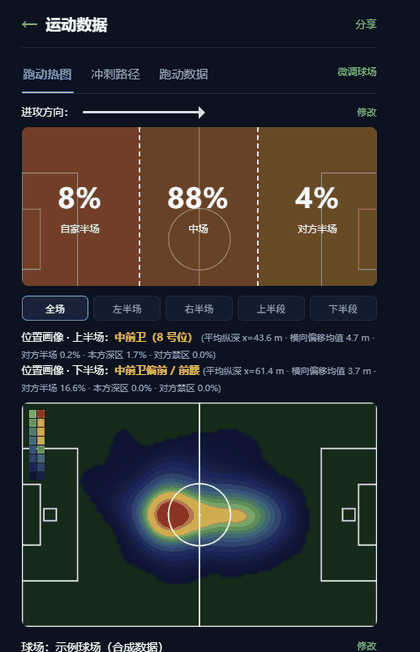

# ⚽ Football Heatmap — 业余球员的足球数据分析流水线

> 把手表里的一场球，变成能看懂的数据：跑动热力图、三分区占比、冲刺路径、跑动数据、心率-速度耦合、位置画像、可交互网页。

**不绑定手表品牌 · 全本地运行 · 开源可改 · 方法有校验**



*演示用合成示例数据录制；面板可交互——切换全场/半场/上下半段、悬停查看每点的速度与心率。*

---

## 它长什么样

| 跑动热力图 | 上下半场位置画像 | 冲刺路径 |
|---|---|---|
| 按停留时间加权的核密度估计（KDE），不是打点 | 自动判定每个半场的位置并给出量化依据 | 每一段高速都画成带方向的箭头 |

截图见 `docs/screenshots/`（用合成示例数据生成，不含任何真实个人数据）。

## 三步上手

```bash
# 1) 安装依赖
python -m pip install -r requirements.txt

# 2) 生成一份合成示例数据（或换成你自己的导出文件）
python tools/make_sample_data.py

# 3) 一键分析：出图 + 交互网页 + 归档
python src/run_all.py
```

Windows 用户也可以直接双击 `run.bat`。

产出：

- `output/figures/` 全部图表（PNG）
- `output/tables/` 全部数据表（CSV）
- `output/panel.html` 前端面板（热图 / 冲刺 / 跑动数据三个页签，可交互）
- `output/*_interactive.html` 卫星底图 + 热力叠加、App 风格轨迹页
- `report/` 分析报告（Markdown，含方法、校验与审计记录）

## 用自己的数据

把你的运动导出文件放进 `data/raw/`，同一场次用同一个前缀：

```
data/raw/
  my_match_2026-06-01.gpx     # 轨迹
  my_match_2026-06-01.tcx     # 心率 + 计圈
  my_match_2026-06-01.csv     # 逐秒心率/速度/距离
```

| 格式 | 轨迹 | 心率 | 逐秒速度 | 计圈 | 累计距离 |
|---|---|---|---|---|---|
| GPX | ✅ | ❌ | ❌ | ❌ | ❌ |
| TCX | ✅ | ✅ | ❌ | ✅ | 圈内 |
| CSV | ❌ | ✅ | ✅ | ❌ | ✅ |

三个格式通道互补，建议都给；只给 GPX 也能出热力图，但没有心率与逐秒速度。

## 球场定位（重要）

GPS 不能自己知道球门在哪，所以位置分析需要一次场地标定：

```bash
# 1) 生成标定页（在卫星图上点四个角）
python tools/calibrate_pitch.py --pitch 30.000000 120.000000   # 换成你的球场中心经纬度

# 2) 把点到的四角登记成一块球场
python tools/register_pitch.py --add "我的主场" --corners lat1 lon1 lat2 lon2 lat3 lon3 lat4 lon4

# 3) 查看 / 切换默认球场
python tools/register_pitch.py
```

**没有标定也能跑**：程序会用轨迹自动拟合一片近似场地（朝向与相对位置可用，绝对尺度不准），并在控制台提示你补标定。

多块球场可以同时登记，一键切换。

## 比赛信息向导

GPS 只能回答「人在哪」，回答不了「谁攻哪边」。所以分析前会问几个只有你知道的问题：

| 问题 | 为什么必须问 |
|---|---|
| 上下半场是否换边 | 换边则两半场坐标系相反，不处理会把两半场混在一起统计 |
| 上半场 / 下半场进攻哪个球门 | 决定是否镜像，使「进攻方向」统一 |
| 中场休息、热身结束、比赛结束时间 | 休息与赛前赛后的活动不该计入跑动统计 |
| 你上下半场打什么位置 | 与数据推断对照（**不会影响推断结果**，见下） |
| 在哪片球场踢的 | 选场地，或新增一块 |

答案写在 `data/raw/<课次>.match_info.json`。

## 数据隔离（本项目的设计原则）

你自报的位置**不会**影响数据给出的结论：

1. 客观事实（球场、换边、进攻方向、比赛窗口）与主观描述（自报位置、备注）**分文件存放**
2. 分析侧按白名单读取，主观字段根本无法进入计算
3. 位置画像先由 5 个坐标指标独立算出，之后才读取自报位置做对照
4. `src/verify_isolation.py` 会做反证测试：伪造自报位置后重算，画像必须完全一致（每次运行自动执行）

## 方法要点

1. **去量化摩尔纹**：GPX 坐标常只保留 5 位小数（约 1 m 台阶），点阵旋转后会产生规则条纹，投影前加半个台阶的均匀抖动（无偏）
2. **等距投影**：转成场地米制坐标（106.0 × 67.3 m 之类的实测尺寸）
3. **比赛窗口**：剔除热身、中场休息、赛后走动
4. **场地裁剪**：剔除场地矩形外的样本（场外走动与漂移）
5. **KDE**：按停留时间加权的高斯核密度（默认 σ=4 m，1 m 网格），单位 秒/平方米；质量守恒误差 < 1%
6. **两种视图**：战术图按进攻方向归一化；卫星叠加图用真实坐标（镜像会让叠加位置错）
7. **速度**：位置差分噪声大，用恒速卡尔曼重建并按官方累计距离定标；与设备速度交叉校验

详细推导、验证数字与已知偏差见 [`docs/METHOD.md`](docs/METHOD.md)。

## 已知限制

- 手表 1 Hz GPS 对急停急转采样不足，高速与冲刺距离系统性偏低
- 足球模式一般不记录步频，无法做加减速/变向分析
- 无队友数据，做不了战术位置与空位分析
- 未标定场地时自动拟合只能保证相对位置

## 目录结构

```
football-heatmap/
  src/         分析脚本（读取、清洗、KDE、绘图、报告、流水线）
  tools/       示例数据生成、球场标定与登记、数据导入
  data/raw/    放你的导出文件（不进版本库）
  data/sample/ 合成示例数据说明
  output/      图表、表格、交互网页
  report/      分析报告与审计记录
  docs/        方法说明、隐私说明、截图
```

## 隐私

仓库不含任何真实个人数据：没有真实姓名、没有真实球场坐标、没有原始运动文件。示例数据由 `tools/make_sample_data.py` 合成，坐标是虚构的。

## License

MIT，见 [LICENSE](LICENSE)。

---

## English (short)

A local, privacy-friendly analysis pipeline for amateur football: turn a watch export (GPX/TCX/CSV) into a dwell-time KDE heatmap, half-pitch zone shares, sprint paths, running data, HR–speed coupling, and an automatic position profile per half. Includes a calibration tool for mapping your pitch from satellite imagery, a match-info questionnaire (side switching, attack direction, match window) and a verifiable data-isolation guarantee between your self-reported position and the data-derived result. Everything runs offline.